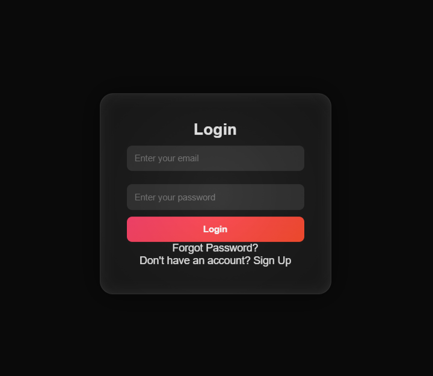
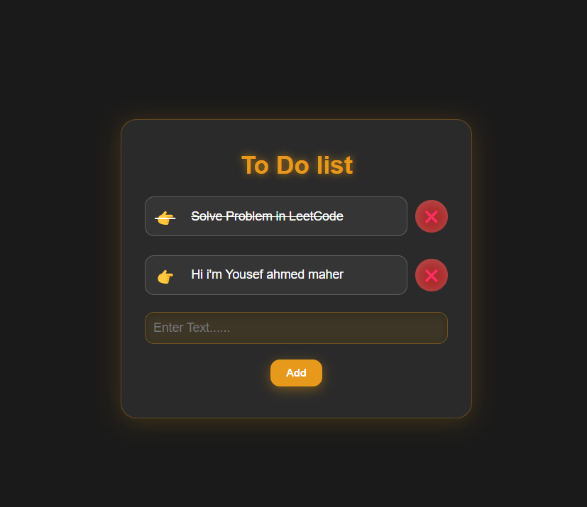

# React Repository

## Introduction
This repository explores the core concepts of React, a popular JavaScript library for building user interfaces. React is component-based, declarative, and efficient, making it ideal for building dynamic web applications.

## What is React?
React is an open-source JavaScript library developed by Facebook for building fast and interactive user interfaces. It allows developers to create reusable UI components and efficiently update the DOM using a virtual representation of the UI.

## What is the Virtual DOM?
The Virtual DOM (VDOM) is a lightweight, in-memory representation of the actual DOM. React uses the Virtual DOM to optimize rendering by minimizing direct manipulations of the real DOM, which can be slow. When a component's state changes, React creates a new Virtual DOM tree and compares it with the previous one, updating only the necessary parts of the real DOM.

## What is the Reconciler?
The Reconciler is the mechanism in React that determines what parts of the UI need to be updated when the application state changes. It efficiently updates the UI by comparing the new Virtual DOM with the previous one and applying minimal changes to the real DOM.

## What is React Fiber?
React Fiber is the latest reconciliation algorithm introduced in React 16. It improves the efficiency of UI updates by breaking rendering work into smaller units that can be paused, resumed, and prioritized. This allows React to handle animations, gestures, and complex updates more smoothly.

## Key Features of React Fiber:
- **Incremental Rendering**: The ability to split work into smaller units.
- **Prioritization**: React Fiber assigns priority levels to updates.
- **Concurrency**: Supports asynchronous rendering for better user experience.
- **Better Error Handling**: Improved mechanisms for handling errors in components.

## Additional Concepts
### JSX (JavaScript XML)
JSX is a syntax extension for JavaScript that allows writing HTML-like code inside JavaScript. React components use JSX to define their UI structure.

### Components & Props
React applications are built using components, which can be either functional or class-based. Props (short for properties) allow components to receive data from their parent components.

### State & Hooks
State allows components to manage dynamic data. Hooks, introduced in React 16.8, enable functional components to use state and lifecycle features without writing class components.

## Exercises, Images, and Videos
This section contains exercises, images, and video resources to help you understand React concepts in depth.

### Exercises
- 1- Login page and good effect in CSS using advanced topics like mask and so on.

### Images


# To-Do List App

A simple React-based To-Do List that allows users to add, mark as complete, and delete tasks.

## Features
- Add new tasks  
- Mark tasks as completed (strikethrough)  
- Delete tasks individually  
- Prevents adding empty tasks  
- Supports adding tasks using the "Enter" key 



### Videos
[Login Video](Login.mp4)

### Source Code

This project includes the following source code files:

- **Login Component**: Implemented in [`Login.tsx`](./Login.tsx)
- **Styles**: Defined in [`page.module.css`](./page.module.css)

### File Descriptions

- **[`Login.tsx`](./Login.tsx)**: This file contains the React functional component for the login page. It includes input fields for user authentication and handles login functionality.
- **[`page.module.css`](./page.module.css)**: This file contains the CSS module for styling the login page, ensuring a clean and responsive design.

### Usage

1. Ensure that the required dependencies are installed by running:
   ```bash
   npm install
   ```
2. Run the project using:
   ```bash
   npm start
   ```

### Additional Information

- The `Login.tsx` component utilizes React hooks such as `useState` and `useEffect` for state management.
- The `page.module.css` file uses CSS modules to scope styles locally, avoiding conflicts with global styles.

Feel free to modify and extend these files to fit your project's needs!


---
This repository is a great resource for both beginners and advanced developers looking to deepen their understanding of React.


